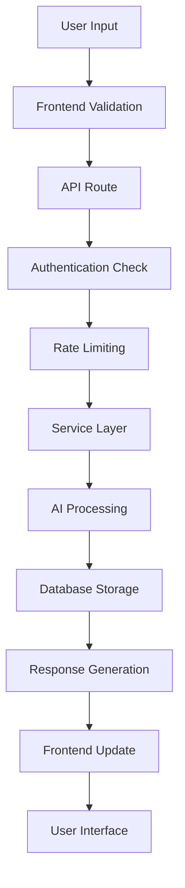

# Grace Church - Technical Architecture

## 🏗️ **System Architecture Overview**

Grace Church is built as a modern, scalable spiritual platform designed to serve thousands of users with enterprise-level reliability and performance.

## 📊 **Architecture Diagram**

```
┌─────────────────────────────────────────────────────────────────┐
│                        CLIENT LAYER                             │
├─────────────────────────────────────────────────────────────────┤
│  Web App (Next.js)  │  Mobile PWA  │  Future Native Apps       │
└─────────────────────────────────────────────────────────────────┘
                                │
                                ▼
┌─────────────────────────────────────────────────────────────────┐
│                         CDN LAYER                               │
├─────────────────────────────────────────────────────────────────┤
│  Netlify CDN  │  Cloudflare  │  Global Edge Caching            │
└─────────────────────────────────────────────────────────────────┘
                                │
                                ▼
┌─────────────────────────────────────────────────────────────────┐
│                      APPLICATION LAYER                          │
├─────────────────────────────────────────────────────────────────┤
│  Next.js API Routes  │  Serverless Functions  │  Edge Runtime   │
└─────────────────────────────────────────────────────────────────┘
                                │
                                ▼
┌─────────────────────────────────────────────────────────────────┐
│                       SERVICE LAYER                             │
├─────────────────────────────────────────────────────────────────┤
│  AI Services  │  Audio Services  │  Bible APIs  │  Auth Service │
└─────────────────────────────────────────────────────────────────┘
                                │
                                ▼
┌─────────────────────────────────────────────────────────────────┐
│                        DATA LAYER                               │
├─────────────────────────────────────────────────────────────────┤
│  Supabase PostgreSQL  │  Redis Cache  │  File Storage          │
└─────────────────────────────────────────────────────────────────┘
```

## 🎯 **Core Components**

### **Frontend Architecture**

#### **Next.js 15 Application**
```typescript
// Component Structure
src/
├── app/                    # App Router (Next.js 13+)
│   ├── (auth)/            # Authentication routes
│   ├── api/               # API routes
│   ├── bible/             # Bible features
│   ├── community/         # Community features (future)
│   ├── hospice/           # Hospice care (future)
│   └── layout.tsx         # Root layout
├── components/            # Reusable UI components
│   ├── auth/              # Authentication components
│   ├── spiritual/         # Spiritual guidance components
│   ├── ui/                # Base UI components
│   └── layout/            # Layout components
├── lib/                   # Utility libraries
│   ├── supabase/          # Database client
│   ├── ai/                # AI service integrations
│   ├── audio/             # Audio processing
│   └── utils/             # Helper functions
└── context/               # React contexts
    ├── AuthContext.tsx    # Authentication state
    ├── LanguageContext.tsx # Multi-language support
    └── SpiritualContext.tsx # Spiritual guidance state
```

#### **State Management**
- **React Context**: Global state for auth, language, spiritual guidance
- **Local State**: Component-level state with useState/useReducer
- **Server State**: SWR/React Query for API data caching
- **Persistent State**: localStorage for user preferences

#### **Styling Architecture**
```css
/* Tailwind CSS with custom Catholic theming */
@tailwind base;
@tailwind components;
@tailwind utilities;

/* Custom CSS variables for theming */
:root {
  --color-sacred-heart: #8B0000;
  --color-marian-blue: #003366;
  --color-liturgical-gold: #FFD700;
  --color-spiritual-purple: #663399;
}

/* Component-specific styles */
.spiritual-gradient {
  background: linear-gradient(135deg, 
    var(--color-marian-blue) 0%, 
    var(--color-spiritual-purple) 100%);
}
```

### **Backend Architecture**

#### **API Layer**
```typescript
// API Route Structure
src/app/api/
├── auth/                  # Authentication endpoints
│   ├── login/route.ts
│   ├── register/route.ts
│   └── logout/route.ts
├── ai/                    # AI service endpoints
│   ├── spiritual-guidance/route.ts
│   ├── prayer-generation/route.ts
│   └── saint-recommendations/route.ts
├── bible/                 # Bible service endpoints
│   ├── search/route.ts
│   ├── verse/route.ts
│   └── daily-readings/route.ts
├── audio/                 # Audio service endpoints
│   ├── tts/route.ts
│   └── prayer-audio/route.ts
├── community/             # Community features (future)
│   ├── parishes/route.ts
│   ├── prayer-requests/route.ts
│   └── forums/route.ts
└── hospice/               # Hospice care endpoints (future)
    ├── support/route.ts
    ├── family-guidance/route.ts
    └── end-of-life-prayers/route.ts
```

#### **Service Layer Architecture**
```typescript
// Service abstraction for scalability
interface SpiritualGuidanceService {
  generateResponse(message: string, context: SpiritualContext): Promise<Response>;
  getFallbackResponse(context: SpiritualContext): Promise<Response>;
  logInteraction(userId: string, interaction: Interaction): Promise<void>;
}

class OpenAISpiritualService implements SpiritualGuidanceService {
  // Primary AI service implementation
}

class HuggingFaceFallbackService implements SpiritualGuidanceService {
  // Fallback AI service implementation
}

class PrewrittenFallbackService implements SpiritualGuidanceService {
  // Final fallback with pre-written responses
}
```

## 🔄 **Data Flow Architecture**

### **User Interaction Flow**


### **AI Response Pipeline**
```typescript
// Multi-tier AI response system
class SpiritualGuidancePipeline {
  async generateResponse(message: string): Promise<SpiritualResponse> {
    try {
      // Tier 1: OpenAI GPT-4
      return await this.openAIService.generate(message);
    } catch (error) {
      try {
        // Tier 2: Hugging Face
        return await this.huggingFaceService.generate(message);
      } catch (error) {
        try {
          // Tier 3: Google Gemini
          return await this.geminiService.generate(message);
        } catch (error) {
          // Tier 4: Pre-written responses
          return await this.fallbackService.generate(message);
        }
      }
    }
  }
}
```

## 🗄️ **Database Architecture**

### **Supabase PostgreSQL Schema**
```sql
-- Users and Authentication
CREATE TABLE users (
  id UUID PRIMARY KEY DEFAULT gen_random_uuid(),
  email VARCHAR(255) UNIQUE NOT NULL,
  created_at TIMESTAMP WITH TIME ZONE DEFAULT NOW(),
  updated_at TIMESTAMP WITH TIME ZONE DEFAULT NOW(),
  spiritual_profile JSONB,
  parish_affiliation VARCHAR(255),
  subscription_tier VARCHAR(50) DEFAULT 'free'
);

-- Spiritual Conversations
CREATE TABLE spiritual_conversations (
  id UUID PRIMARY KEY DEFAULT gen_random_uuid(),
  user_id UUID REFERENCES users(id),
  user_message TEXT NOT NULL,
  sister_grace_response TEXT NOT NULL,
  ai_service_used VARCHAR(50),
  spiritual_context JSONB,
  created_at TIMESTAMP WITH TIME ZONE DEFAULT NOW(),
  conversation_rating INTEGER CHECK (conversation_rating >= 1 AND conversation_rating <= 5)
);

-- Prayer Requests
CREATE TABLE prayer_requests (
  id UUID PRIMARY KEY DEFAULT gen_random_uuid(),
  user_id UUID REFERENCES users(id),
  request_text TEXT NOT NULL,
  is_public BOOLEAN DEFAULT FALSE,
  parish_id UUID,
  created_at TIMESTAMP WITH TIME ZONE DEFAULT NOW(),
  status VARCHAR(50) DEFAULT 'active'
);

-- Community Features (Future)
CREATE TABLE parishes (
  id UUID PRIMARY KEY DEFAULT gen_random_uuid(),
  name VARCHAR(255) NOT NULL,
  diocese VARCHAR(255),
  country VARCHAR(100),
  contact_email VARCHAR(255),
  spiritual_director_id UUID,
  created_at TIMESTAMP WITH TIME ZONE DEFAULT NOW()
);

-- Hospice Care (Future)
CREATE TABLE hospice_support_sessions (
  id UUID PRIMARY KEY DEFAULT gen_random_uuid(),
  patient_id UUID,
  family_member_id UUID REFERENCES users(id),
  session_type VARCHAR(100),
  spiritual_guidance TEXT,
  chaplain_notes TEXT,
  created_at TIMESTAMP WITH TIME ZONE DEFAULT NOW()
);

-- Subscription Management (Future)
CREATE TABLE subscriptions (
  id UUID PRIMARY KEY DEFAULT gen_random_uuid(),
  user_id UUID REFERENCES users(id),
  tier VARCHAR(50) NOT NULL,
  stripe_subscription_id VARCHAR(255),
  status VARCHAR(50),
  current_period_start TIMESTAMP WITH TIME ZONE,
  current_period_end TIMESTAMP WITH TIME ZONE,
  created_at TIMESTAMP WITH TIME ZONE DEFAULT NOW()
);
```

### **Database Optimization**
```sql
-- Indexes for performance
CREATE INDEX idx_conversations_user_id ON spiritual_conversations(user_id);
CREATE INDEX idx_conversations_created_at ON spiritual_conversations(created_at);
CREATE INDEX idx_prayer_requests_user_id ON prayer_requests(user_id);
CREATE INDEX idx_prayer_requests_parish_id ON prayer_requests(parish_id);

-- Full-text search for spiritual content
CREATE INDEX idx_conversations_search ON spiritual_conversations 
USING gin(to_tsvector('english', user_message || ' ' || sister_grace_response));
```

## 🔐 **Security Architecture**

### **Authentication & Authorization**
```typescript
// Multi-layer security approach
interface SecurityLayer {
  authenticate(request: Request): Promise<User | null>;
  authorize(user: User, resource: string, action: string): Promise<boolean>;
  rateLimit(user: User, endpoint: string): Promise<boolean>;
}

// Role-based access control
enum UserRole {
  USER = 'user',
  PREMIUM_USER = 'premium_user',
  PARISH_ADMIN = 'parish_admin',
  SPIRITUAL_DIRECTOR = 'spiritual_director',
  CHAPLAIN = 'chaplain',
  SYSTEM_ADMIN = 'system_admin'
}
```

### **Data Privacy & Encryption**
- **End-to-end encryption** for sensitive spiritual conversations
- **GDPR compliance** with data retention policies
- **Confession-level privacy** for spiritual guidance
- **Secure API key management** with rotation policies

## 📈 **Scalability Architecture**

### **Horizontal Scaling Strategy**
```typescript
// Load balancing configuration
interface ScalingConfig {
  regions: ['us-east-1', 'eu-west-1', 'ap-southeast-1'];
  autoScaling: {
    minInstances: 2,
    maxInstances: 50,
    targetCPU: 70,
    targetMemory: 80
  };
  database: {
    readReplicas: 3,
    connectionPooling: true,
    queryOptimization: true
  };
}
```

### **Caching Strategy**
```typescript
// Multi-level caching
interface CacheLayer {
  // Level 1: Browser cache
  browserCache: {
    staticAssets: '1 year',
    apiResponses: '5 minutes',
    userPreferences: 'session'
  };
  
  // Level 2: CDN cache
  cdnCache: {
    images: '1 year',
    css: '1 year',
    javascript: '1 year',
    api: 'no-cache'
  };
  
  // Level 3: Application cache
  applicationCache: {
    bibleVerses: '1 day',
    saintInformation: '1 week',
    liturgicalCalendar: '1 day'
  };
  
  // Level 4: Database cache
  databaseCache: {
    queryResults: '15 minutes',
    userSessions: '1 hour',
    spiritualContent: '1 day'
  };
}
```

## 🔮 **Future Architecture Considerations**

### **Microservices Migration**
```typescript
// Service decomposition for scale
interface MicroserviceArchitecture {
  services: {
    userService: 'User management and authentication',
    spiritualGuidanceService: 'AI-powered spiritual direction',
    bibleService: 'Scripture search and daily readings',
    audioService: 'TTS and audio processing',
    communityService: 'Parish and community features',
    hospiceService: 'End-of-life spiritual care',
    paymentService: 'Subscription and donation processing'
  };
  
  communication: {
    synchronous: 'REST APIs for real-time interactions',
    asynchronous: 'Message queues for background processing',
    eventDriven: 'Event sourcing for audit trails'
  };
}
```

### **AI/ML Pipeline Enhancement**
```typescript
// Advanced AI architecture for future
interface AIArchitecture {
  models: {
    primaryModel: 'Fine-tuned Catholic spiritual guidance model',
    fallbackModels: 'Multiple specialized models for different contexts',
    localModels: 'Edge deployment for privacy-sensitive conversations'
  };
  
  training: {
    continuousLearning: 'Feedback-based model improvement',
    spiritualValidation: 'Theological review of AI responses',
    culturalAdaptation: 'Regional and cultural customization'
  };
}
```

### **Global Deployment Strategy**
```typescript
// Multi-region deployment for global reach
interface GlobalArchitecture {
  regions: {
    americas: 'Primary deployment in US East',
    europe: 'GDPR-compliant deployment in EU',
    asia: 'Regional deployment for Asia-Pacific',
    africa: 'Future expansion for African missions'
  };
  
  localization: {
    languages: 'Support for 20+ languages',
    cultures: 'Regional Catholic traditions',
    liturgy: 'Local liturgical calendars'
  };
}
```

## 📊 **Monitoring & Observability**

### **Application Monitoring**
```typescript
// Comprehensive monitoring stack
interface MonitoringStack {
  metrics: {
    applicationMetrics: 'Response times, error rates, throughput',
    businessMetrics: 'User engagement, spiritual guidance effectiveness',
    infrastructureMetrics: 'CPU, memory, database performance'
  };
  
  logging: {
    structuredLogging: 'JSON-formatted logs with correlation IDs',
    spiritualAuditLogs: 'Privacy-compliant spiritual interaction logs',
    securityLogs: 'Authentication and authorization events'
  };
  
  alerting: {
    criticalAlerts: 'System downtime, security breaches',
    warningAlerts: 'Performance degradation, high error rates',
    spiritualAlerts: 'Crisis intervention triggers'
  };
}
```

---

**This architecture is designed to serve the Catholic community with enterprise-level reliability while maintaining the spiritual authenticity and privacy that sacred conversations require.**

